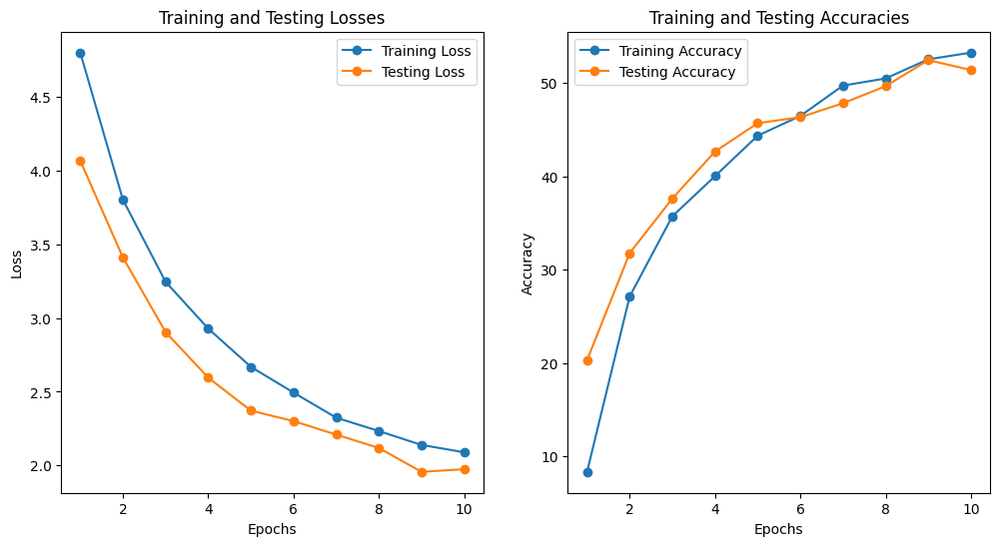
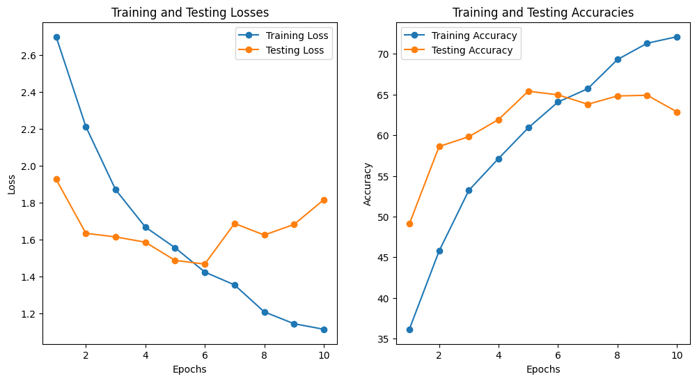
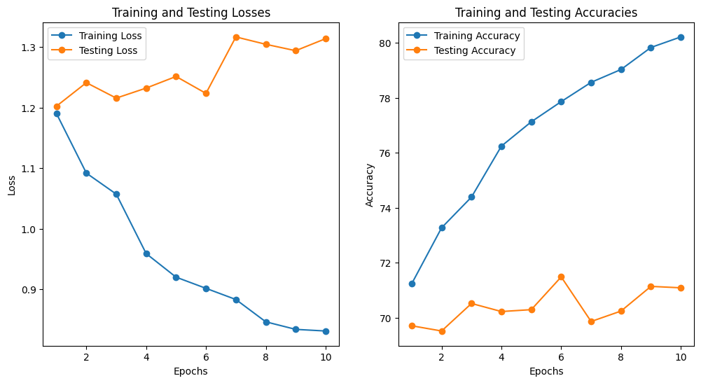
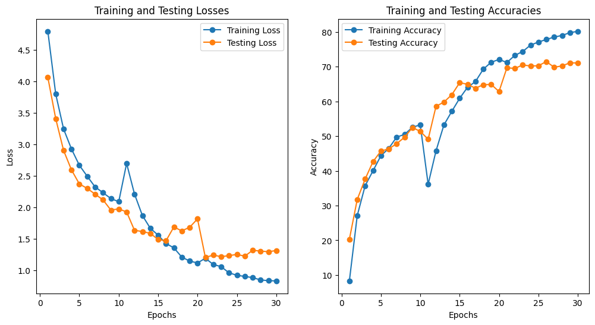

# GNR 638 Mini Project 1

## Fine-grained classification:

1. Train a CNN model with an upper limit of 10M parameters.

1. Please download CUB dataset from here: https://data.caltech.edu/records/65de6-vp158/files/CUB_200_2011.tgz?download=1

1. Use default train-test split for this task.

1. Submissions will be evaluated based on parameter efficiency, training time efficiency (no. of iterations) and accuracy.

1. Submissions should include report, code and final model checkpoint. Drive link is fine for checkpoint.

1. Report must include architecture and traiining details. Training loss and accuracy curves should also be incorporated along with final results.

1. External models: Only ImageNet pretrained models are allowed.

1. Please use moodle forum or mail to gnr638@googlegroups.com to post queries.

1. Deadline: March 5 2024, 11:59 PM

## Link to saved checkpoint and report

Report and saved checkpoint for all commits are uploaded <a href="https://drive.google.com/drive/folders/1zwp_PTMYcLLTw7xsScSCKxkZ4L6m9hwM?usp=sharing">here</a>

## How to use?

- Download the dataset from <a href="https://drive.google.com/drive/folders/1zwp_PTMYcLLTw7xsScSCKxkZ4L6m9hwM?usp=drive_link">here</a>
- Clone/Download the repo
- Extract the `.tgz` file in the repo folder
- `cnn_classification.ipynb` have all the util functions and hyperparams
- By default we use default number of train/test dataset
- For data augmentation, call `data_augmentation()` function before calling `train_mode` function
- To call the train function use this

```python
train_model(model,
            criterion = nn.CrossEntropyLoss(),
            learning_rate=learning_rate,
            optimizer = None,
            schedular=None,
            num_epoch=num_epoch,
            save_checkpoint=False,
            time_start_from=0):
```

## How to use pre-trained model like Efficient-Net_v2?

- Keep above points in mind
- Open `efficientnet_no_data_augmentation.ipynb`
- Run all cells of the `.ipynb` file

## Architecture Used: EfficientNet_B1_Weights.IMAGENET1K_V2

The exact architecture can be found in `efficientnet_no_data_augmentation.ipynb`

<table>
  <caption>Model Performance on IMAGENET dataset</caption>
  <tr>
    <th>Weight</th>
    <th>Acc@1</th>
    <th>Acc@5</th>
    <th>Params</th>
    <th>GFLOPS</th>
  </tr>
  <tr>
    <td>EfficientNet_B1_Weights.IMAGENET1K_V2</td>
    <td>79.838</td>
    <td>94.934</td>
    <td>7.8M</td>
    <td>0.69</td>
  </tr>
</table>

Changes in classifier layer of EfficientNet

```python
Sequential(
  (0): Dropout(p=0.4, inplace=True)
  (1): Linear(in_features=1280, out_features=200, bias=True)
)
```

## Training our model

### 1. Fine Tune the classifier (for other parameters `requires_grad=False`)

Number of training parameters = 256200


### 2. Transfer Learning (all parameters `requires_grad=True`)

Number of training parameters = 6769384


### 3. Fine Tune the classifier (for other paramters `requires_grad=False`)

Number of training parameters = 256200


## Final Accuracy and Loss graph



### Results

- **Top 1 Accuracy:** 71.48%
- **Time required for training:** 26 min 54 sec
- **Total Number of Parameters:** 6,769,384

**Fine Tuning:**

- Total Number of Parameters: 256,200

**Transfer Learning:**

- Total Number of Parameters: 6,769,384
